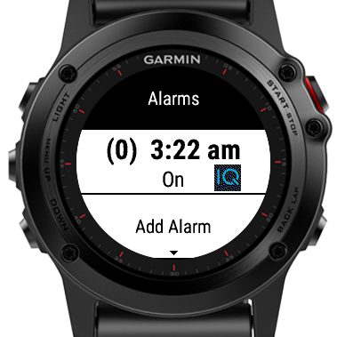

== Dynamic Menu for Garmin CIQ

DMenu.mc is an implementation of a dynamic menu where the menu ordering and length can be changed and an optional value line can be shown below the menu item name.  

It is similar to how the Alarm Clock menu (menu -> Clock -> Alarm Clock) works.

A rather trivial app is included to demonstrate its use.  Every other alarm will show an icon and selecting an alarm will toggle the On/Off status.

== Changing The Look of a Menu

The DMenuItem class holds details about a menu item such as its name and any value to display when the item is in the selectable position.

To change how a selectable or non selectable menu item looks derive a new class, extending DMenuItem (as IconMenu does in the test example).

You can replace or extend the following functions to augment or replace how a menu item is drawn.

* setHighlightColor (dc)
* setColor (dc)
* function drawLabel (dc, y)
* function drawHighlightedLabel (dc, y)

In the IconMenu sample the icon is only shown when the menu item is selectable (i.e. highlighted) and the menu item is drawn as standard and then the icon is drawn.

Note use is made of duck typing and any class can be added to the menuArray providing it has a draw method and has an index instance variable that is set to pass the index of the selected menu item incase the selected behaviour needs to modify the array in some way, for example delete the selected menu item.

== LICENCE

Licence MIT

Copyright (c) 2016 Dave Baldwin <dave@briarside.co.uk>

Permission is hereby granted, free of charge, to any person obtaining a copy
of this software and associated documentation files (the "Software"), to deal
in the Software without restriction, including without limitation the rights
to use, copy, modify, merge, publish, distribute, sublicense, and/or sell
copies of the Software, and to permit persons to whom the Software is
furnished to do so, subject to the following conditions:

The above copyright notice and this permission notice shall be included in
all copies or substantial portions of the Software.

THE SOFTWARE IS PROVIDED "AS IS", WITHOUT WARRANTY OF ANY KIND, EXPRESS OR
IMPLIED, INCLUDING BUT NOT LIMITED TO THE WARRANTIES OF MERCHANTABILITY,
FITNESS FOR A PARTICULAR PURPOSE AND NONINFRINGEMENT. IN NO EVENT SHALL THE
AUTHORS OR COPYRIGHT HOLDERS BE LIABLE FOR ANY CLAIM, DAMAGES OR OTHER
LIABILITY, WHETHER IN AN ACTION OF CONTRACT, TORT OR OTHERWISE, ARISING FROM,
OUT OF OR IN CONNECTION WITH THE SOFTWARE OR THE USE OR OTHER DEALINGS IN
THE SOFTWARE.
